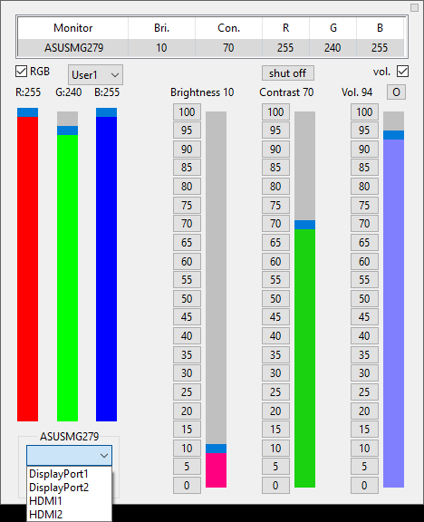

# Full software kvm switch for VMs

I already wrote on [Sharing HID devices with KVM virtual machine](#!pages/kvm-hid.md), but this is way better. It solves same problem but more elegantly and painless than ever. For description of the problem read original article. This article assumes you have to GPUs one of which is dedicated to host and another is dedicated to VM. You use one main monitor that has multiple outputs. Two outputs are connected one to each GPU. Monitor must be i2c-capable!

## Perquisites

* sshd server on Linux host.
* [ddcutil](http://www.ddcutil.com/)
* [ClickMonitorDDC](http://clickmonitorddc.bplaced.net/)
* [putty.exe](https://the.earth.li/~sgtatham/putty/latest/x86/putty.exe)
* [puttygen.exe](https://the.earth.li/~sgtatham/putty/latest/x86/puttygen.exe)

## Host Setup

1. Core of our setup is shell script attaching and detaching USB devices as well as controlling monitor input. Save script below to `/usr/local/bin/vm-attach.sh`
```bash
	#!/usr/bin/env bash

	monitor=1
	output=3
	devices=(1234:5678 9ABC:DEFG)
	vmname=$(virsh list | sed -n '3p' | sed -nr 's/ *[0-9]+ +(.*) +running/\1/p')

	attach_device() {
			vmname=$1
			device=(${2//:/ })
			action=$3
			xml_name=/tmp/device-${device[0]}:${device[1]}.xml

			echo "<hostdev mode='subsystem' type='usb'>"      > $xml_name
			echo "  <source>"                                >> $xml_name
			echo "          <vendor id='0x${device[0]}'/>"   >> $xml_name
			echo "          <product id='0x${device[1]}'/>"  >> $xml_name
			echo "  </source>"                               >> $xml_name
			echo "</hostdev>"                                >> $xml_name

			virsh $action-device $vmname $xml_name
	}

	if [ "$1" == "attach" ];
	then
			for dev in "${devices[@]}"
			do
					attach_device "$vmname" $dev attach
			done
            ddcutil setvcp 60 $monitor --bus=$output
	else
			for dev in "${devices[@]}"
			do
					attach_device "$vmname" $dev detach
			done
	fi
```
2. You will need to edit above script and replace `devices` array values with correct `vendor:product` ids from `lsusb`. You can add more than two devices. You can add devices that do not necessarily are connected - script will gracefully fail when they are missing and work when they are connected.
3. Set `monitor` value to i2c device of your monitor you would like to switch. Set `output` value to correct output on your monitor. Setting these can be bit of trial and error. Out of 4 outputs on my monitor i can toggle between two - DVI and HDMI.
4. Now make new ssh key with `ssh-keygen -t rsa -b 4096 -C "vm-attach"`.
5. Extract public key with `ssh-keygen -y -f ~/.ssh/vm-attach.id_rsa`
6. Edit `/root/.ssh/authorized_keys` to contain:
```
    command="/usr/local/bin/vm-attach.sh detach",no-port-forwarding,no-x11-forwarding,no-agent-forwarding ssh-rsa AAAAB3N<.... rest of your extracted key>
```
7. For a good measure do `chmod -R 600 /root/.ssh && chmod 700 /root/.ssh`.
8. Nvidia users may need to create `/etc/X11/xorg.conf.d/20-nvidia-ddc.conf` that fixes i2c support (required for `ddcutil`):
```
	Section "Device"
			Driver          "nvidia"
			Identifier      "Videocard0"
			Option          "RegistryDwords" "RMUseSwI2c=0x01; RMI2cSpeed=100"
	EndSection
```
9. Run `sudo modprobe i2c-dev` to load required i2c module and create file `/etc/modules-load.d/i2c.conf` with a single line to automate module loading on boot:
```
i2c-dev
```

Host setup is done. Invoking `sudo vm-attach.sh attach` you should get your USB devices and monitor switched to a VM.

## VM setup

Since Windows is most common case that is what i will be detailing in this section. Besides if you got so far and you want same setup for linux setup will be pretty obvious to you anyway.

1. Install `ClickMonitorDDC`. For sake of simplicity i downloaded portable version and copied `ClickMonitorDDC_4_4.exe` to documents folder where i placed other scripts though it is not necessary.
2. Copy `vm-attach.id_rsa` from host to VM and use `puttygen.exe` to convert it to `vm-attach.ppk`.
3. Create and save new connection using `putty.exe` to connect to `root@host_ip_addr`. Use `vm-attach.ppk` for auth. Save it with name `vm-attach`.
4. Create powershell script `detach.ps1`. You may need to change `1` to reflect correct output used by host.
```ps
C:\Users\User\Documents\ClickMonitorDDC_4_4.exe s DisplayPort1	# Switches monitor output to one used by host
C:\Users\User\Documents\putty -load vm-attach					# Executes vm-attach connection saved in putty
```

You need to select correct monitor output. In my case it was `DisplayPort1` but in your case it may be different. Available outputs are displayed here:



And that's it. Running this script will first switch monitor output to the host and then execute `/usr/local/bin/vm-attach.sh detach` which should detach usb devices.

## AutoHotkey script

I use following AutoHotkey script. Just place it into same folder with `ClickMonitorDDC_4_4.exe` and `putty.exe`. It creates `ctrl+printscreen` binding for switching input and monitor to host and `shift+printscreen` for switching only input.
```
SendMode Input
#SingleInstance Force
#NoEnv
Process, Priority,, High

^PrintScreen::
  Run nowindow.exe ClickMonitorDDC_4_4.exe s DisplayPort1
  Run nowindow.exe putty.exe -load vm-detach
  return

+PrintScreen::
  Run nowindow.exe putty.exe -load vm-detach
  return
```

## Conclusion

With bit of effort and right hardware we have achieved full software KVM switch. In [previous article](#!pages/kvm-hid.md) i mentioned binding these commands to hotkeys. Binding same hotkey on both host and VM gives perfect experience - as if you were toggling between two computers using KVM switch. Best part - this solution uses off-the-shelf parts and is way simpler than previous attempt. Enjoy!
